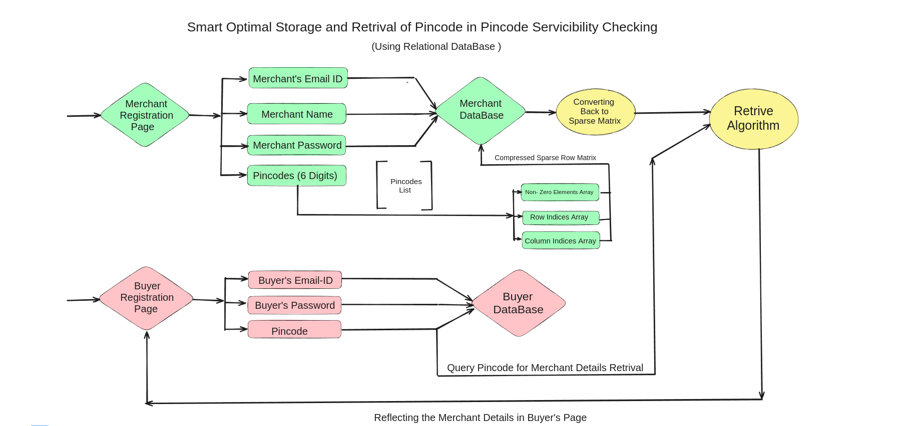

# 🌍 Pincode based Serviceability checker with optimal storage & retrieval in m*n sparse matrix
Quote:*"If you don't understand what problem anyone want to solve,just try to understand what is getting input and output in that Computational box"*
## Project Active Website Link: http://34.132.50.54:8080/
## Project Description
 <p>Pincode based serviceability allows merchants to define the pincodes where they can deliver their products & services,
i.e. merchants define the pincodes they serve and buyer apps verify whether a particular pincode (of buyer) can be served by any of the available merchants;</p>
<p>Considering there are more than 30K pincodes and at least 100 million merchants (of which about 10% may enable pincode based serviceability), this requires an optimal data structure for storing the pincode serviceability by merchant (i.e. a sparse matrix of 10M*30K) so that verification is near real-time.</p>

## Features
* __Flask Web Application__:
    <p>Utilizes Flask, a Python micro-framework for web development.
    <p>Implements routes for rendering HTML templates and handling API requests.
* __SQLite Database Integration__:
    <p>Uses SQLite for database management.
    <p>Configures SQLAlchemy for database operations, including table creation and data manipulation.
* __Merchant Model__:
    <p>Defines the structure of the Merchant database table.
    <p>Includes fields for merchant ID, name, password, and pincode data storage.
* __Buyer Model__:
    <p>Defines the structure of the Buyer database table, stored in a separate database.
    <p>Fields include buyer ID, password, and associated pincode for serviceability checks.
* __Routes and Views__:
    <p>Implements routes for the application's main pages: index, about, and contact.
    <p>Renders HTML templates using Flask's render_template function.
* __API Endpoints__:
    <p>Provides endpoints for submitting buyer and merchant data via POST requests.
    <p>Parses JSON data sent by clients and stores it in the respective database tables.
* __Merchant Pincode Retrieval__:
    <p>Includes a method within the Merchant model to retrieve merchants based on provided pincodes.
    <p>Utilizes sparse matrix operations to efficiently search for matching pincodes.
* __Data Validation and Processing__:
    <p>Validates and processes data received from clients before storing it in the database.
    <p>Converts pincode lists to strings for storage and retrieves them as lists for processing.
* __Error Handling__:
    <p>Implements basic error handling for database operations and API requests.
    <p>Prints informative messages for debugging purposes.
* __Initialization and Execution__:
    <p>Drops existing database tables and creates new ones upon application startup.
    <p>Runs the Flask application in debug mode for easy troubleshooting.

## Dependencies
* __Flask (v2.0.2)__:
    <p>Flask is a lightweight Python web framework that provides tools, libraries, and patterns to help build scalable web applications.
    <p>We use Flask to create the web application, handle routes, and render HTML templates.
* __Flask-SQLAlchemy (v3.0.0)__:
    <p>Flask-SQLAlchemy is an extension for Flask that simplifies the interaction between Flask applications and SQLAlchemy, a powerful SQL toolkit and Object-Relational Mapping (ORM) library for Python.
    <p>This extension facilitates database operations, including table creation, querying, and data manipulation, within Flask applications.
* __scipy (v1.7.3)__:
    <p>SciPy is a Python library used for scientific and technical computing.
    <p>We utilize SciPy's scipy.sparse module to work with sparse matrices efficiently. This is particularly useful for handling large datasets and optimizing memory usage in operations such as pincode retrieval and matrix manipulation.
* __HTML (HyperText Markup Language)__:
    <p>HTML is the standard markup language for creating web pages and web applications.
    <p>We use HTML to structure the content of web pages, defining elements such as headings, paragraphs, lists, and links.
* __CSS (Cascading Style Sheets)__:
    <p>CSS is a style sheet language used for describing the presentation of a document written in HTML.
    <p>We use CSS to enhance the visual appearance of web pages, including layout, colors, fonts, and animations.
* __JavaScript__:
    <p>JavaScript is a programming language that enables interactive web pages and dynamic content.
    <p>We use JavaScript to add interactivity to the web application, such as form validation, DOM manipulation, and asynchronous communication with the server.
* __render_template Function__:
    <p>In Flask, the render_template function is used to render HTML templates and pass data to them for dynamic content generation.
    <p>We use render_template to render HTML templates for different routes in the web application, enabling the presentation of dynamic content to users.

## How to Install and Run the Project
* Clone the repository:
    ```bash
    git clone git@github.com:ShubhamDas8981/Storage_optimization_build_for_bharat.git
    ```
* Create and Activate the Virtual Environment:
    ```bash
    python -m venv venv
    # Activate the virtual environment for Windows
    venv\Scripts\activate
    # Activate the virtual environment for macOS and Linux
    source venv/bin/activate
    ```
*  Install Dependencies:
    ```bash
    pip install -r requirements.txt
    ```
* Run the project in terminal:
    ```bash
    python app.py
    ```

## Working of the Application:


## Purpose of the Project
<p>The purpose of the provided project appears to be the development of a web application that facilitates interaction between merchants and buyers based on pincode-based serviceability. Here's a breakdown of its key purposes:

### 1. Merchant Management:
* Enable merchants to register and manage their accounts within the system.
* Merchants can provide information such as their IDs, names, passwords, and lists of pincodes where they can deliver their products or   services.

### 2. Buyer Registration:
* Allow buyers to register and interact with the system.
* Buyers can create accounts with unique IDs, passwords, and specify their delivery locations using pincodes.

### 3. Pincode-Based Serviceability:
* Implement functionality to determine serviceability for a given pincode.
* Merchants can define the pincodes where they can deliver their products or services. Buyers can specify their pincode for serviceability checks.

### 4. Interaction Between Merchants and Buyers:
* Facilitate interaction between merchants and buyers based on pincode serviceability.
* Buyers can submit their pincode, and the system will retrieve merchants who can deliver to that pincode.

### 5. Database Management:
* Utilize SQLite databases to store information about merchants and buyers.
* Implement database models for merchants and buyers to organize and manage data efficiently.

### 6. Web Interface:
* Provide a user-friendly web interface for merchants and buyers to interact with the system.
* Utilize HTML templates, CSS for styling, and JavaScript for dynamic behavior to enhance user experience.

<p> Overall, the project aims to streamline the process of connecting merchants with buyers based on pincode-based serviceability, providing a platform for efficient delivery of products or services.

## Contributing to this Project
 * __Reporting Bugs__: If you find a bug, please ensure that it hasn't already been reported. If not, open a new issue providing as much detail as possible, including the steps to reproduce the bug.
 * __Suggesting Enhancements__:If you have an idea for an enhancement, open an issue outlining your proposal. Be sure to include details about the suggested feature and how it would improve the project.
* __Pull Requests__:
    * Fork the repository and create your branch from main.
    * Test your changes thoroughly.
    * Commit your changes with clear and descriptive commit messages.
    * Push your branch to your fork and submit a pull request.
    * Ensure that your pull request is linked to an existing issue or create a new issue for it.
    * Your pull request will be reviewed, and further adjustments may be requested before merging.

## Contact us:
* Email-Id: codingshubham.in@gmail.com
* Email-Id: yashmukherjee62@gmail.com
